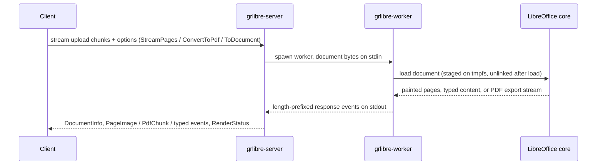

# grpc-libreoffice

A C++ gRPC server that renders office documents through LibreOfficeKit.
Clients stream document bytes in and receive either every page as a PNG
image or the document as a PDF, streamed back. Pages render directly from
the office core's tile painter; no intermediate PDF exists on the page path.

The server exists for three reasons:

1. LibreOffice is a desktop process, not a service. LibreOfficeKit embeds the
   office core, and this server puts that behind gRPC with a stable wire
   contract.
2. Crash isolation. Every document is rendered by its own short-lived worker
   process that loads the core, renders, and exits. A crash or hang in the
   core kills one worker; the server maps it to a gRPC status and moves on.
3. Document bytes never touch persistent disk. All per-document writable
   paths (the uploaded document, the office user profile, the office core's
   temp spills) live under a memory-backed tmpfs, verified at startup and
   again by every worker; the uploaded document is deleted the moment the
   office core has loaded it, and a produced PDF streams from the export
   filter without ever being staged as a file. The container runs with a
   read-only root filesystem. One honest limit: tmpfs pages are swappable,
   so on a host with swap enabled the kernel may page document bytes to the
   swap device; run swapless or with encrypted swap where that matters.
   LibreOffice's broken-package repair, which rewrites the upload through
   the core's own staging, is an explicit per-request opt-in
   (`allow_package_repair`) and off by default.

## Request flow



## API

`ai.pipestream.office.v1.OfficeRenderService` (see `proto/`, linted with buf
at STANDARD plus COMMENTS):

- `StreamPages(stream StreamPagesRequest) returns (stream StreamPagesResponse)`.
  The client streams the document as chunks, marking the last one `complete`.
  The server responds with `DocumentInfo` (resolved format, page count,
  document class), then one `PageImage` per page in page order (PNG, with
  pixel dimensions and effective DPI), then typed content events, then one
  final `RenderStatus`. Spreadsheets emit one image per sheet, presentations
  one per slide.

  Typed content comes from the same loaded document the pages were painted
  from, in one pass with no second conversion: `DocumentMetadata` (title,
  author, subject, keywords, numeric timestamps) for every document type,
  and for text documents `Paragraph` events (style, outline level, list
  level, exact caret positions in twips from the live layout, runs with
  font, size, weight, slant, underline, strikethrough, color), `TableData`
  events (grid dimensions and named, addressed cells), and `EmbeddedImage`
  events (original or re-encoded bytes, anchor position, laid-out size),
  `Footnote` events (label, anchor, content runs), `HeaderFooter` content
  per page style, `PageStyleInfo` (page size, margins, columns, in twips),
  `DocumentIndex` events (tables of contents and other generated
  indexes), `TextFrame` events (styled runs, layout anchor, laid-out size,
  and text-chain names), and `Shape` events for text-bearing draw-page
  shapes, imported textboxes included; draw-page groups are recursed, each
  group emitted as its own `Shape` event with `is_group` and its children
  naming their ancestors through `group_path`. Text documents also emit
  `Comment` events (author, initials, date, content, resolved state, reply
  threading, and the anchored range's span and covered text), `TrackedChange`
  events (kind, author, date, span, changed text, and nesting data),
  `Bookmark` events (name, span, covered text), and `FormField` events for
  in-text fieldmarks (checkbox state, dropdown entries and selection, text
  content, every stored parameter) and draw-page form controls (label,
  state, geometry); runs everywhere carry their hyperlink URL, target, and
  name, so link spans fall out of the run offsets. Presentations emit
  slide annotations as `Comment` events with slide-local positions.
  Drawing documents emit `DrawingShape` events (shape type, name,
  position and size in twips, rotation, group nesting, text runs) in
  page-then-paint order, plus `EmbeddedImage` events for image shapes.
  Embedded objects emit `EmbeddedObject` events for every document class:
  charts with typed numeric series, categories, titles, and a tabular
  projection walked from the live chart model; embedded spreadsheets as a
  used-range cell grid; Math formulas as their StarMath command; and other
  OLE payloads with their replacement graphic, geometry, and class id.
  Spreadsheets emit one `Sheet` header per sheet (name, visibility, tab
  color, used bounds, print areas) followed by `SheetRow` events carrying
  only the used range's non-empty typed cells (cell type, formula, numeric
  value, display string, number-format key and code, merge span), plus
  `SheetCellComment`, `SheetChart`, and `SheetPivotTable` events per sheet
  and `SheetNamedRange` and `SheetDatabaseRange` events per workbook.
  Presentations emit one `Slide` header per slide (name, autolayout,
  master page) followed by `SlideShape` events in paint order, each with
  its placeholder role, geometry in twips, and text paragraphs carrying
  outline depth, plus the speaker-notes shape of each notes page. Body
  runs carry character offsets in a documented annotation text space, so
  standoff annotations (NLP spans) anchor to the stream directly.
  For text documents, `Paragraph`, `TableData`, and `EmbeddedImage` events
  additionally carry true per-line bounding rectangles (`LineBox`, in
  document-absolute twips) measured from the same layout the pages were
  painted from: a wrapping or page-straddling paragraph yields one box per
  laid-out line in reading order, and body paragraph lines also carry the
  item-local code-point boundaries of each line's characters.
  Every event is emitted the moment it exists, so a caller can process page
  images while typed content is still streaming. Extraction problems degrade
  to `RenderStatus.warnings`, never a failed render.

  A request can select which parts are emitted through `StreamOptions`
  (`DocumentPart` values, page images included). An empty selection means
  every part except `DOCUMENT_PART_CELL_LINE_RECTS`, which attributes line
  rectangles to individual table cells (`TableCellData.line_rects`) at one
  selection round-trip per cell and therefore must be listed explicitly.
  The work behind an unselected part is skipped, not just its emission.
  `StreamOptions` also carries an optional per-request `render_dpi`
  (clamped to 24-600, zero means the server default); every page reports
  the DPI it actually rendered at in `PageImage.dpi`. A 1-based inclusive
  `first_page`/`last_page` range restricts which pages are painted at all
  (zero means unbounded on that side): pages outside it are never rendered,
  while `DocumentInfo` keeps the full page count and typed content is
  unaffected: page 50 of a 224-page document costs one page's paint, not
  224. Page images encode as lossless PNG by default; a request can select
  lossy JPEG or WebP with a quality knob (`page_format`, `page_quality`,
  default 85), or SVG vector pages (`vector_format` / `page_format=SVG`).
  Every `PageImage` names the encoding it carries in its `format` field.
  Measured on document pages, WebP at the default quality cuts payloads
  2-4x against PNG; JPEG only pays off on photographic pages and can
  exceed PNG on text. `max_width_px` fits each page to a pixel width
  (still clamped by the per-side bound); `grayscale` converts rasters
  before encoding; `timeout_seconds` overrides the per-document deadline.
  `tracked_changes` selects Writer redline display (as-is / final /
  original / show markup). `skip_hidden` omits hidden sheets and slides
  from page images; `paint_used_range` crops spreadsheet pages to the
  used cell range; `include_notes_pages` appends each slide's notes page.
  `form_values` writes named form fields before paint or export;
  `redact_spans` blacks out annotation-space character ranges on rasters
  and draws matching rectangles on PDF export.
  `DocumentInfo` and `RenderStatus` are always sent.
  `DocumentInfo` also carries the layout rectangle of every page in the
  same twips space the typed positions use, so a consumer can map any
  document-absolute position to page-local coordinates.
- `ConvertToPdf`: same upload contract; the response streams the PDF as
  ordered chunks instead of page images. The PDF flows straight from the
  export filter's output stream into the chunk events, so it never exists
  as a service file or as one whole buffer in the worker. The request
  carries the same timeout, tracked-change, form-fill, redact, skip-hidden,
  and page-range knobs as `StreamOptions`.
- `ToDocument`: same upload and `StreamOptions` as `StreamPages`; the
  server folds the event stream into one `ai.pipestream.document.v1.Document`
  and returns it with `DocumentInfo` and `RenderStatus`.
- `GetServiceInfo`: versions, limits, and accepted source formats, for
  orchestrators and tool facades. It also advertises the diskless posture
  (`diskless_documents`), whether `ToDocument` is implemented
  (`document_mapping`), whether `allow_package_repair` actually repairs
  (`package_repair`), and names the LibreOffice-internal temp artifacts
  (`internal_temp_artifacts`) so callers can reason about their own threat
  model.

The source format resolves from the filename extension first and the content
type second; unresolvable documents are rejected with `INVALID_ARGUMENT`.
Accepted formats cover the Word, Excel, and PowerPoint families (modern and
legacy), the OpenDocument families, RTF, CSV, HTML, and plain text.

Errors are gRPC status codes: `INVALID_ARGUMENT` (no bytes, missing complete
flag, unresolvable format, out-of-range options, or the core cannot load
the document), `RESOURCE_EXHAUSTED` (over the byte cap),
`FAILED_PRECONDITION` (broken package needing repair without the
`allow_package_repair` opt-in), `DEADLINE_EXCEEDED` (per-document timeout,
worker killed), `INTERNAL` (worker crash). Health checking and reflection
are registered.

A document whose zip package is broken but repairable is a special case:
LibreOffice can only open it through its repair path, which rebuilds the
package from what it can salvage and stages that copy through the core's
own temp machinery. Accepting a rewritten document is gated behind the
explicit `allow_package_repair` request field (default false). By default
such a document fails with `FAILED_PRECONDITION` naming the field; with
the opt-in the worker retries the load with `RepairPackage=true`. A
package that still will not open fails as `INVALID_ARGUMENT`. A broken
package is never repaired silently.

Accepted formats also include PDF, which the core imports through Draw;
PDF pages rasterize like any other document and, because the import
produces a drawing model, emit `DrawingShape` typed content.

The repo also carries `ai.pipestream.document.v1`, the pipestream document
structure schema, and a consumer-side mapper (built into the server
library) that folds a `StreamPages` event stream into one such `Document`:
items in typed arenas linked by JSON Pointer refs, groups per sheet, slide,
frame, and drawing group, headers and footers as furniture, speaker notes
on the notes layer, and per-line page-local bounding boxes with exact
per-line charspans as provenance. The mapper never touches LibreOffice and
builds a valid document from any part selection.

## Process model

The server buffers each upload under a hard byte cap, then spawns
`grlibre-worker` with the document on stdin. The worker initializes
LibreOfficeKit with its own user profile, loads the document, and writes
length-prefixed response events to stdout, which the server relays to the
gRPC stream as they arrive. A concurrency gate bounds simultaneous workers;
a deadline kills workers that hang. Worker exit codes distinguish "could not
load the document" (client error) from crashes (server error).

Uploaded document bytes never touch disk. Each worker gets a private 0700
work dir on a RAM-backed tmpfs (`GRLIBRE_TMPFS_DIR`, default `/dev/shm`);
the server refuses to start when that directory is not tmpfs, and the
worker refuses a work dir that is not tmpfs, with no disk fallback either
way. The document is staged there just long enough for the office core to
open it and is unlinked the moment the load returns (the core keeps its own
descriptors, so lazy reads of embedded media keep working). The core's own
temp spills (`TMPDIR`) are pinned inside the same tmpfs: an ODF load keeps
a full package copy there for the document's lifetime, a PDF upload is
staged in full by the office core's PDF import, and embedded media
spill their raw bytes plus derived bitmaps, so size the tmpfs for the
document plus those spills, times the number of concurrent workers. In pdf
mode the PDF streams straight from the export filter's output stream into
chunk events; the one remaining materialization is LibreOffice-internal
(the pdf filter renders into a named temp file and copies it out, unlinking
it right after), and it lives in the same tmpfs `TMPDIR`. File locking is
disabled through the worker profile, so no `.~lock` siblings are written
anywhere.

## Configuration

| Variable | Default | Meaning |
|---|---|---|
| `GRLIBRE_PORT` | `50053` | Listen port |
| `GRLIBRE_MAX_DOCUMENT_MIB` | `100` | Per-document byte cap |
| `GRLIBRE_MAX_CONCURRENT_DOCUMENTS` | `2` | Worker processes in flight |
| `GRLIBRE_TASK_TIMEOUT_SECONDS` | `120` | Per-document deadline |
| `GRLIBRE_RENDER_DPI` | `144` | Default page render DPI; a request may override it via `StreamOptions.render_dpi` |
| `GRLIBRE_MAX_PAGE_PIXELS` | `4096` | Per-side pixel bound; pages downscale to fit |
| `GRLIBRE_LO_PATH` | `/usr/lib/libreoffice/program` | LibreOffice installation |
| `GRLIBRE_TMPFS_DIR` | `/dev/shm` | tmpfs for per-worker work dirs; startup fails if it is not tmpfs |
| `GRLIBRE_METRICS_INTERVAL_SECONDS` | `60` | Metrics line interval, `0` disables |

## Build and run

Requires cmake, a C++17 toolchain, LibreOfficeKit headers
(`libreofficekit-dev`), the LibreOffice SDK (`libreoffice-dev`, for the
typed content extraction that attaches to the in-process UNO model), and
LibreOffice itself at runtime. gRPC and libwebp are fetched and built by
CMake; UNO type headers are generated by cppumaker during the build.

```bash
cmake -S . -B build -DCMAKE_BUILD_TYPE=Release
cmake --build build -j
ctest --test-dir build --output-on-failure

docker build -t grlibre .
docker run --rm --read-only --tmpfs /tmp:rw,size=1g -p 50053:50053 grlibre
```

The image build runs the full test suite, including real renders through a
headless LibreOffice, before an image can exist. Tests author their fixtures
in memory; the render tests skip cleanly on machines without LibreOffice.

## Demo kit

The repo carries a self-contained demo and evaluation kit around the server;
none of it is needed to build or run the service itself.


`fixtures/fetch.sh` downloads (or locally converts) a sample document set:
docx, doc, xlsx, xls, pptx, odt, rtf, pdf, including a 224-page docx for
stress runs.

`frontend/` is a demo web UI: a small Node BFF speaks gRPC to the server
and streams events to the browser, which shows page images popping in as
they arrive, live timing stats, typed-content counts, and one-click PDF
download. Render options (DPI, page range, PNG/JPEG/WebP/SVG page format
with a quality knob, grayscale, fit-to-width, tracked-change display,
skip-hidden / used-range / notes pages, and a per-request timeout) sit
above the results. Run `npm install && npm start` in `frontend/`, then open
`http://localhost:8080`.

`clients/` holds example clients in Python, Node.js, and Java. Each is a
small CLI with `info`, `pages <file> [outdir]`, `pdf <file> [out.pdf]`,
and `todoc <file>`. `pages` exposes the `StreamOptions` knobs (`--dpi`,
`--first-page`/`--last-page`, `--format`/`--quality`, `--parts`,
`--max-width`, `--grayscale`, `--timeout`, `--tracked-changes`,
`--skip-hidden`, `--used-range`, `--notes`, `--form`, `--redact`,
`--repair`). See `clients/README.md`.

`bench/run.sh` is the speed test: per-document latency (time to first
page, total, pages/sec) in pages-only, full-extraction, and PDF modes,
plus a concurrency sweep for throughput. See `bench/README.md` for sample
numbers.

`scripts/e2e-smoke.sh` boots a private server on a free port, streams a
fixture through `StreamPages` and `ConvertToPdf`, and fails loudly on any
regression; it is the quickest "is the tree healthy" check after a build.

`scripts/demo.sh` is the one-command demo: it builds the server if needed,
boots it and the frontend (idempotently), verifies the wiring, and prints
the URL. `scripts/demo.sh --stop` tears both down.
